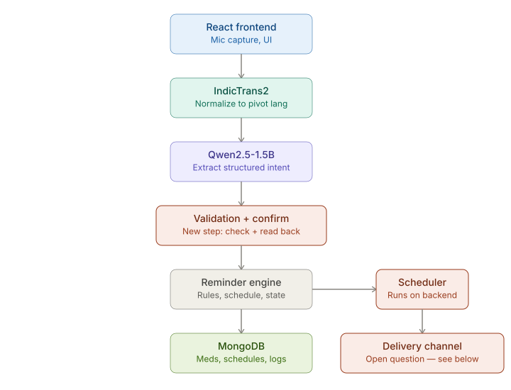
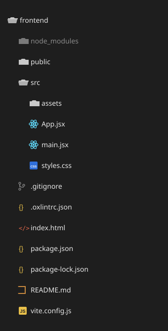
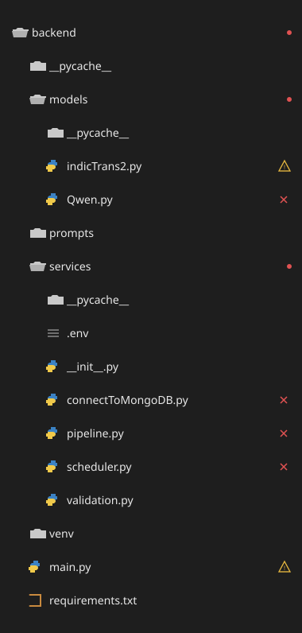

#  Local-Language AI Chatbot For Elderly Medicine Reminders: NLP/AI system designed for voice-first, multilingual medication support (V1.0)

AI models which I’ve chosen :
<b> IndicTrans2 (Local language to English) — </b> using it as a pivot-language normalizer (local language → English/Hindi → back) 
makes sense given Qwen2.5's Indic-language support is comparatively weak versus English. Keep this, 
but be aware every added hop (ASR→MT→LLM→MT→TTS) adds latency — for elderly users expecting a conversational feel, 
test end-to-end latency early, not at the end.

<b> Qwen2.5-1.5B (English to JSON query) - </b> Instruct for intent extraction — fine for structured JSON extraction, but for a medical use case,
don't trust it blind. Add a validation/confirmation layer: schema-check the extracted fields (drug name against
a known list, dose within sane bounds, time in valid format), and always read the parsed entry back to the user 
via TTS for confirmation before writing to MongoDB. Medicine-name misrecognition is the single biggest safety risk 
in this pipeline — ASR errors on drug names are common and consequences are real.

<b> Working of the Front page using React — </b> A React webpage only works while someone has it open in a browser tab. Elderly users won't 
keep a tab open waiting for reminders. You need a backend scheduler (e.g., node-cron or a Celery/APScheduler job) 
that fires independently of the browser and pushes the reminder through a channel that reaches them passively — a phone call 
(IVR-style, reusing your TTS), SMS, or WhatsApp, not just an in-page notification.  (Only implemented the react part yet)

<p align="center">
  
</p>

<br>
<b>Reminder Engine - </b> This is the business logic layer. It doesn't run on a timer itself, it's the code that:
<li> Takes validated intent from the LLM step (e.g. "remind me to take metformin at 8am and 8pm daily") and turns it into structured records </li>
<li> Applies rules: handling recurring schedules, time zones, "take with food" style conditions, skip/snooze logic, dose adjustments  </li>
<li> Talks to MongoDB to persist and update medicine/schedule/log data  </li>
<li> Exposes functions like createReminder(), markTaken(), getUpcomingReminders(), escalateIfMissed() </li>
<br>

<b>Scheduler (scheduler.py) - </b> Scheduler triggers reminders at the right wall-clock time. It periodically (or via cron-like triggers) 
asks the reminder engine "what's due right now?" and kicks off the delivery flow (call/SMS/TTS).

<b>Validation (validation.py) - </b> It takes the data extracted by Qwen and fills any missing fields with default values like “medicine,” “1 tablet,” “night,” and “everyday.” It creates a clean reminder object containing medicine, dose, time, and frequency and always returns valid: True along with the completed reminder data.

## Guide to run the project:

1) open frontend folder and run npm run dev
2) open backend folder and run a) pip install -r requirements.txt b) uvicorn main:app --reload
3) open terminal and run brew services start mongodb-community

# Requirements.txt:

```python
fastapi
uvicorn[standard]
python-multipart
transformers==4.51.3
torchaudio
"onnxruntime==1.20.1"
"onnx==1.20.1"
"onnxruntime-gpu==1.20.1"
sentencepiece
torch
numpy
soundfile
indictranstoolkit
"accelerate>=1.10"
apscheduler
python-dateutil
pymongo
python-dotenv
bson
datetime
```

## Text Recognition
For the text recognition, i've used the google built-in Web Speech API (SpeechRecognition) which captures the voice.
The voice is then converted to text in finalVariable, and later stored in the <b>transcript</b> variable. 

## Frontend and Backend Architecture

<p align="center">
  
  
</p>

### Qwen.py (if you want to run locally):

```python
import torch
import json
from transformers import AutoModelForCausalLM, AutoTokenizer

MODEL = "Qwen/Qwen2.5-1.5B-Instruct"
tokenizer = None
model = None

dtype = (
    torch.bfloat16
    if torch.cuda.is_available() and torch.cuda.is_bf16_supported()
    else torch.float16
    if torch.cuda.is_available()
    else torch.float32
)

def load_model():
    global tokenizer, model

    print("Loading Qwen...")

    tokenizer = AutoTokenizer.from_pretrained(MODEL)

    model = AutoModelForCausalLM.from_pretrained(
        MODEL,
        torch_dtype=dtype,
        device_map="auto",
    )

    print("Qwen loaded successfully.")


def run_model(prompt):

    if model is None or tokenizer is None:
        raise RuntimeError("Qwen model has not been loaded.")

    finalPrompt = f"""
Extract the medicine reminder information from the user message.

User message:
{prompt}

Return ONLY valid JSON.
Do not include any explanation or extra text.

Use exactly these fields:
{{
    "medicine": "",
    "dose": "",
    "time": "",
    "frequency": ""
}}
"""

    print("Qwen prompt:")
    print(finalPrompt)

    inputs = tokenizer(
        finalPrompt,
        return_tensors="pt"
    ).to(model.device)

    outputs = model.generate(
        **inputs,
        max_new_tokens=150,
        do_sample=False,
    )

    generated = outputs[0][inputs["input_ids"].shape[1]:]

    response = tokenizer.decode(
        generated,
        skip_special_tokens=True
    ).strip()

    print("Qwen raw response:")
    print(response)

    try:
        decoder = json.JSONDecoder()
        for i, char in enumerate(response):
            if char == "{":
                try:
                    result, _ = decoder.raw_decode(response[i:])
                    break
                except json.JSONDecodeError:
                    continue
        else:
            print("Qwen did not return valid JSON.")
            return None

    except Exception as e:
        print("Error parsing Qwen response:", e)
        return None

    print("Qwen JSON:")
    print(result)

    return result

```

<br>

### indicTrans2.py (if you want to run locally):

```python
import torch
from transformers import AutoModelForSeq2SeqLM, AutoTokenizer
from IndicTransToolkit.processor import IndicProcessor

# conda activate indicf5
# recommended to run this on a gpu with flash_attn installed
# don't set attn_implemetation if you don't have flash_attn

DEVICE = "cuda" if torch.cuda.is_available() else "cpu"

src_lang = "tam_Taml"
tgt_lang = "eng_Latn"
model_name = "ai4bharat/indictrans2-indic-en-dist-200M"
tokenizer = AutoTokenizer.from_pretrained(model_name, trust_remote_code=True)

ip = IndicProcessor(inference=True)

def load_model ():
    global model
    model = AutoModelForSeq2SeqLM.from_pretrained(
        model_name,
        trust_remote_code=True,
        torch_dtype=torch.float16, # performance might slightly vary for bfloat16
        attn_implementation="flash_attention_2"
    ).to(DEVICE)
    ip = IndicProcessor(inference=True)

def translate_to_english (input):

    input_sentences = [
        input
    ]

    batch = ip.preprocess_batch(input_sentences, src_lang=src_lang, tgt_lang=tgt_lang)

    # Tokenize the sentences and generate input encodings
    inputs = tokenizer(
        batch,
        truncation=True,
        padding="longest",
        return_tensors="pt",
        return_attention_mask=True,
    ).to(DEVICE)

    # Generate translations using the model
    with torch.no_grad():
        generated_tokens = model.generate(
            **inputs,
            use_cache=True,
            min_length=0,
            max_length=256,
            num_beams=5,
            num_return_sequences=1,
        )

    # Decode the generated tokens into text
    generated_tokens = tokenizer.batch_decode(
        generated_tokens,
        skip_special_tokens=True,
        clean_up_tokenization_spaces=True,
    )

    # Postprocess the translations, including entity replacement
    translations = ip.postprocess_batch(generated_tokens, lang=tgt_lang)

    for input_sentence, translation in zip(input_sentences, translations):
        print(f"{src_lang}: {input_sentence}")
        print(f"{tgt_lang}: {translation}")

    return translations[0]
```

## Database (MongoDB):

All the JSON queries are being stored in the backend with database being medvoice and collection being the reminders. The JSON queries look as:

```python
{
  _id: ObjectId('id'),
  medicine: 'medicine',
  dose: 'dose',
  time: 'time'',
  frequency: 'frequence',
  status: 'active' or 'inactive'
}
```


